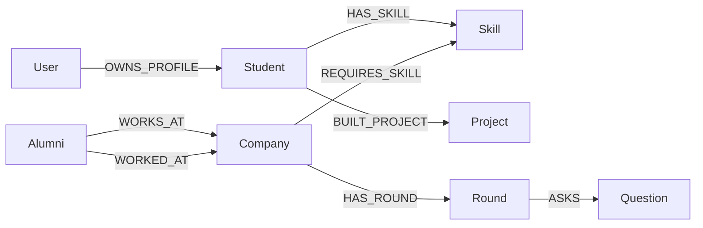

# NEXUS — Placement Intelligence & Skill Graph Engine

> A graph-powered college placement analytics, recommendation, and career roadmap platform built with **Next.js 16 (App Router)** and **Neo4j AuraDB**.

---

## 🌟 Overview

**NEXUS** transforms placement data into an intelligent, connected knowledge graph. It analyzes relationships between students, alumni career trajectories, required company skills, and interview patterns to deliver real-time career intelligence.

- **Dynamic Skill-Gap Engine**: Evaluates readiness scores and pinpoints missing skills for target roles.
- **Company Recommendations**: Graph-based match scoring weighted by student proficiencies and hiring criteria.
- **Alumni Path Replay**: Visualizes career journeys and transitions from university to top tech companies.
- **Interactive Knowledge Graph**: Explore student-skill-company relationships visually.
- **Interview Preparation Bank**: Curated rounds and technical question banks for targeted preparation.
- **Role-Based Access**: Multi-tenant authorization system supporting `ADMIN` and `STUDENT` roles.

---

## 🛠️ Tech Stack

- **Framework**: Next.js 16 (React 19, TypeScript)
- **Database**: Neo4j AuraDB (via `neo4j-driver`)
- **Authentication**: JWT via `jose` with secure HTTP-only cookies
- **Styling**: Tailwind CSS & Vanilla CSS design system
- **Visualization & UI**: Framer Motion & Recharts
- **Mailing**: Nodemailer (SMTP)

---

## 🏗️ Neo4j Graph Data Model

### Node Labels
- `User`: Authentication and account credentials.
- `Student`: Student academic profiles, CGPA, target roles, and links.
- `Company`: Hiring partner entities, package offerings, locations, and requirements.
- `Skill`: Standardized technical proficiencies.
- `Alumni`: Alumni profiles and graduation years.
- `Round` & `Question`: Interview rounds and preparation question bank.
- `Project`: Academic and portfolio projects.

### Key Relationships


---

## 🚀 Getting Started

### 1. Prerequisites
- Node.js (v18.17 or higher)
- npm, yarn, or pnpm
- A Neo4j AuraDB instance (or self-hosted Neo4j 5.x+)

### 2. Installation
Clone the repository and install dependencies:
```bash
git clone https://github.com/your-username/BigData.git
cd BigData
npm install
```

### 3. Environment Configuration
Create a `.env.local` file in the project root:


Configure your environment variables in `.env.local`:
```env
# Neo4j Database
NEO4J_URI=neo4j+s://your-instance-id.databases.neo4j.io
NEO4J_USERNAME=neo4j
NEO4J_PASSWORD=your_neo4j_password
NEO4J_DATABASE=neo4j

# Security & Secrets
JWT_SECRET=your_super_secret_jwt_key_at_least_32_chars
PASSWORD_SALT=your_random_secure_password_salt

# Default Admin Account (Seeded automatically)
ADMIN_EMAIL=admin@nexus.edu
ADMIN_PASSWORD=your_secure_admin_password

# Email / SMTP (Optional)
SMTP_HOST=smtp.gmail.com
SMTP_PORT=587
SMTP_SECURE=false
SMTP_USER=your_email@example.com
SMTP_PASS=your_smtp_app_password
SMTP_FROM="NEXUS <no-reply@nexus.local>"
```


---

## 💻 Running the Application

Run the development server:
```bash
npm run dev
```

Open [http://localhost:3000](http://localhost:3000) in your browser.

To create a production build:
```bash
npm run build
npm run start
```

---

## 🔐 Default Credentials & Roles

| Role | Email / Identifier | Default Password | Description |
| :--- | :--- | :--- | :--- |
| **Admin** | `admin@nexus.edu` | `ADMIN_PASSWORD` from `.env` | System administrator dashboard & seed controls |
| **Student** | Seeded student email | `password` | Student dashboard, skill-gap analysis, recommendations |

*New students can also register independently via `/register`.*

---

## 📡 API Reference

### Authentication
- `POST /api/auth/login` — Authenticate and issue JWT cookie.
- `POST /api/auth/register` — Register a new student account.
- `GET /api/auth/me` — Retrieve active session payload.
- `POST /api/auth/logout` — Clear session cookies.

### Admin
- `POST /api/admin/seed` — Seed Neo4j database from dataset.
- `GET /api/admin/overview` — Get graph statistics and system health.
- `GET /api/admin/cohorts` — Get student cohort distributions.

### Student & Intelligence
- `GET /api/dashboard` — Main metrics and placement readiness.
- `GET /api/recommendations` — Scored company recommendation list.
- `GET /api/skill-gap` — Comprehensive skill gap analysis against company criteria.
- `GET /api/alumni` — Alumni career timelines and company history.
- `GET /api/graph` — Interactive graph visualization nodes and edges.
- `GET /api/companies` — Directory of hiring companies and open roles.
- `GET /api/companies/[id]` — Detailed company profile, interview rounds, and questions.

---

## 🔒 Security Best Practices

1. **Keep Secrets Out of Version Control**: Always maintain real credentials in `.env.local`. Ensure `.gitignore` is never bypassed with `-f`.
2. **Rotate Credentials**: If any credentials were ever exposed in development, rotate them immediately before production deployment.
3. **Strong Production Secrets**: Ensure `JWT_SECRET` and `PASSWORD_SALT` are at least 32 cryptographically random characters in production environments.

---

## 📄 License

This project is open source and available under the [MIT License](LICENSE).
